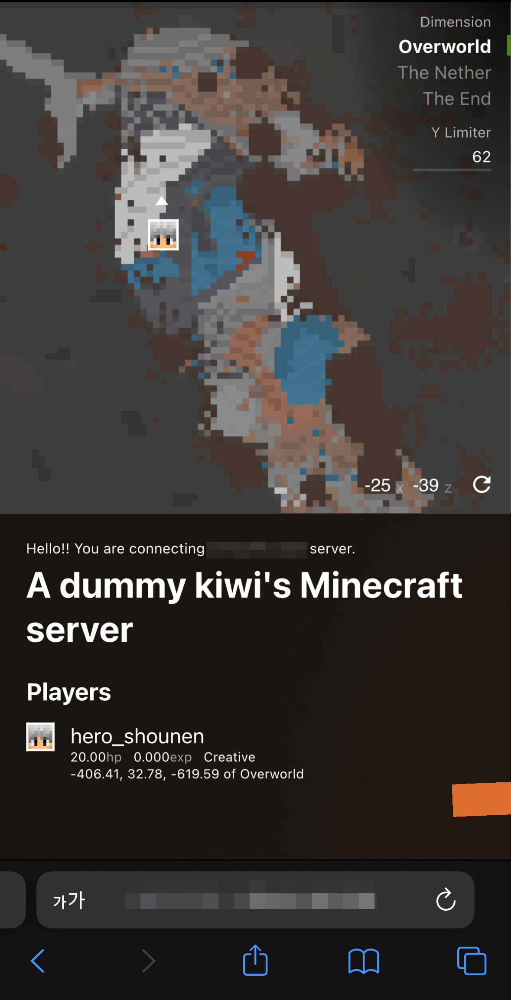

# spoon.minecraft-nested-server
마인크래프트 서버 내의 API 서버를 통해 웹이나 기타 플랫폼에서 마인크래프트 서버의 정보를 가져와보자!

### 컨셉
마인크래프트 서버 안에서 또다른 API 백엔드 서버 및 React 프론트 서버, WebSocket 서버를 열어 
외부에서 마인크래프트 서버 주소(포트는 다름)로 접속하여 현재 서버의 상태를 확인할 수 있도록 해보자는 컨셉입니다.

### 와... 안느려요??
몇몇 작업을 제외하면 그렇게 무겁지 않아서... 그냥 지인들끼리 노는 5명 이하의 서버에서는 느리지 않은 것 같습니다.  

프론트에서 접속하는 사람이 적으면 안느릴거에요. 아마...

### 할 수 있는 것
- 웹소켓 서버
  - 플레이어 위치 및 쳐다보는 방향 실시간 확인
  - 인벤토리 실시간 확인
  - 기타 체력 및 exp 등의 실시간 확인
- API 서버
  - 원격 커멘드 실행 (이거는 사용자 및 권한관리를 통해 접근제어를 수행하고 있습니다)
  - 월드의 특정 위치에 대한 지형 지도 표시
    - 불변 단방향 그림자 지원
    - 로드된 청크에 대해 그렇게 느리지 않은 속도
    - 아직 불안정하지만 yLimit을 지정하여 지형 단면을 볼 수 있음
  - 기타 웹소켓 서버가 돌려주는 데이터를 여기서도 요청 가능
- React 프론트 서버
  - 위에서 제공하는 것들을 한 곳에 모아 시각적으로 확인 가능
  
### 어떻게 생겼는데 그래서
프론트는 접속하면 대략 이렇게 생겼습니다:

